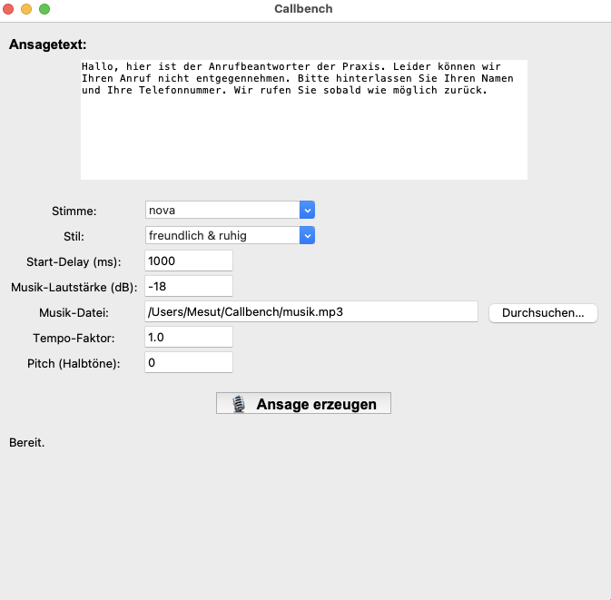

# 📞 Callbench

Dieses Projekt erzeugt professionelle **Telefonansagen** mit einer grafischen Oberfläche (Tkinter)  
und der **OpenAI Text-to-Speech API** (`gpt-4o-mini-tts`).  
Optional kann eine Hintergrundmusik (z. B. `musik.mp3`) leise unterlegt werden.

---

## ✨ Features

- Eingabe des Ansagetexts in einer GUI  
- Auswahl der Stimme (z. B. `nova`, `alloy`, `shimmer`, `coral`, …)  
- Start-Delay der Stimme (Musik läuft vorher an)  
- Musik-Lautstärke (in dB)  
- Sprechtempo (Tempo-Faktor)  
- Tonhöhe (Pitch in Halbtönen)  
- Export als `ansage_final.wav` und `ansage_final.mp3`  

---

## 🐍 Voraussetzungen

- **Python 3.12** (nicht 3.13 – wegen `audioop`)  
- **pip**  
- **git**  
- **ffmpeg**  
- **OpenAI API Key**  
- *(optional)* Eine Hintergrundmusik-Datei (`musik.mp3`) im Projektordner  

---

## 🍏 Installation auf macOS

```bash
# Repository klonen
git clone https://github.com/xmo111x/Callbench.git
cd Callbench

# Virtuelle Umgebung
python3.12 -m venv .venv
source .venv/bin/activate

# Abhängigkeiten installieren
pip install -r requirements.txt

# ffmpeg installieren (z. B. via Homebrew)
brew install ffmpeg

# OpenAI API Key setzen (temporär)
export OPENAI_API_KEY="sk-...."

# Dauerhaft (in ~/.zshrc)
echo 'export OPENAI_API_KEY="sk-...."' >> ~/.zshrc
source ~/.zshrc

# Starten
python ansage_gui.py
```

---

## 🪟 Installation auf Windows

```powershell
git clone https://github.com/xmo111x/Callbench.git
cd Callbench
python -m venv .venv
.venv\Scripts\activate
pip install --upgrade pip
pip install -r requirements.txt
choco install ffmpeg
$env:OPENAI_API_KEY="sk-...."
[System.Environment]::SetEnvironmentVariable('OPENAI_API_KEY', 'sk-....', 'User')
python ansage_gui.py
```

---

## 🐧 Installation auf Linux

```bash
git clone https://github.com/xmo111x/Callbench.git
cd Callbench
sudo add-apt-repository ppa:deadsnakes/ppa -y
sudo apt update
sudo apt install python3.12 python3.12-venv python3.12-distutils -y
python3.12 -m venv .venv
source .venv/bin/activate
pip install --upgrade pip
pip install -r requirements.txt
sudo apt install ffmpeg -y
export OPENAI_API_KEY="sk-...."
echo 'export OPENAI_API_KEY="sk-...."' >> ~/.bashrc
source ~/.bashrc
python ansage_gui.py
```

---

## 🎵 GEMA-freie Musik

Ich habe die Musik von **Pixabay Music** heruntergeladen.  
Sie ist **GEMA-frei** und erfordert **keine Registrierung**:  
👉 [https://pixabay.com/music/](https://pixabay.com/music/)

---

## ▶️ Nutzung

1. Ansagetext in das Textfeld eintragen  
2. Stimme, Stil, Delay, Musik-Lautstärke, Tempo und Pitch einstellen  
3. Auf **„Ansage erzeugen“** klicken  
4. Die Dateien `ansage_final.wav` und `ansage_final.mp3` werden im Projektordner erstellt  

---

🛠 Entwickelt mit ❤️ von **Mesut**



